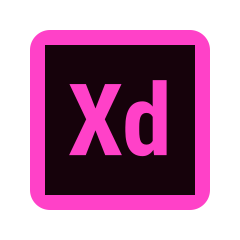

## <h1>Hi, I am Omar 👋  </h1>

## Summary

 
 
I'm a Mid-level Angular front-end developer with two years of experience designing and building responsive,
user-friendly web applications. Proficient in Angular, TypeScript, and modern front-end technologies.
Passionate about creating efficient, scalable, and maintainable code. A strong collaborator with experience
working in Agile teams to deliver high-quality solutions on time 💻🌐.

 

## Education

- Bachelor's degree in Computer Science, (Kafr El Sheikh University, Faculty of Computers and Information).
- Internship with Information Technology Institute ( ITI ) in Web Development.
- Front End Web development (Angular) Diploma in Route Academy.

## Technical Skills

#### ▶️ Programming Languages :

<table style="width: 100%;">
    <tr style="width: 100%;">
        <td align="center" width="96">
            

                
                
C#

            

        </td>
        <td align="center" width="96">
            

                
                
Java

            

        </td>
               <td align="center" width="96">
            

                
                
javascripts

            

        </td>
        <td align="center" width="96">
            

                
                
Typescript

            

        </td>
    </tr>
</table>

#### ▶️ Frameworks :

<table style="width: 100%;">
    <tr style="width: 100%;">
        <td align="center" width="96">
            

                
                
Angular 2+

            

        </td>
        <td align="center" width="96">
            

                
                
Bootstrap

            

        </td>
               <td align="center" width="96">
            

                
                
Tailwind css

            

        </td>
               <td align="center" width="96">
            

                
                
Material ui 

            

        </td>
    </tr>
</table>

#### ▶️ Frontend Technologies :

<table style="width: 100%;">
    <tr style="width: 100%;">
        <td align="center" width="96">
            

                
                
Html5

            

        </td>
        <td align="center" width="96">
            

                
                
CSS3

            

        </td>
        <td align="center" width="96">
            

                
                
Sass 

            

        </td>
        <td align="center" width="96">
            

                
                
JQuery 

            

        </td>
        <td align="center" width="96">
            

                
                
Json 

            

        </td>
    </tr>
</table>

#### ▶️ unit testing :

<table style="width: 100%;">
    <tr style="width: 100%;">
        <td align="center" width="96">
            

                
                
Karma

            

        </td>
        <td align="center" width="96">
            

                
                
Jest

            

        </td>
    </tr>
</table>

#### ▶️ Liberiries :

<table style="width: 100%;">
    <tr style="width: 100%;">
        <td align="center" width="96">
            

                
                
Highcharts

            

        </td>
        <td align="center" width="96">
            

                
                
Fontawesome

            

        </td>
        <td align="center" width="96">
            

                
                
Google Fonts

            

        </td>
    </tr>
</table>

#### ▶️ State Management :

<table style="width: 100%;">
    <tr style="width: 100%;">
        <td align="center" width="96">
            

                
                
NGRX

            

        </td>
        <td align="center" width="96">
            

                
                
RXJS

            

        </td>
    </tr>
</table>

#### ▶️ Databases :

<table style="width: 100%;">
    <tr style="width: 100%;">
        <td align="center" width="96">
            

                
                
SQL SMS

            

        </td>
        <td align="center" width="96">
            

                
                
MySql

            

        </td>
               <td align="center" width="96">
            

                
                
Firbase

            

        </td>
    </tr>
</table>

#### ▶️ Design :

<table style="width: 100%;">
    <tr style="width: 100%;">
        <td align="center" width="96">
            

                
                
Figma

            

        </td>
        <td align="center" width="96">
            

                
                
Adobe XD

            

        </td>
    </tr>
</table>

#### ▶️ Tools :

<table style="width: 100%;">
    <tr style="width: 100%;">
        <td align="center" width="96">
            

                
                
Trello

            

        </td>
        <td align="center" width="96">
            

                
                
Miro

            

        </td>
        <td align="center" width="96">
            

                
                
NPM

            

        </td>
    </tr>
</table>

#### ▶️ Version Control :

<table style="width: 100%;">
    <tr style="width: 100%;">
        <td align="center" width="96">
            

                
                
Git

            

        </td>
        <td align="center" width="96">
            

                
                
Github

            

        </td>
               <td align="center" width="96">
            

                
                
Vercel

            

        </td>
    </tr>
</table>

## Github Stats 📉 & Top Languages 🤖 :

## Contact Me 💬 :

